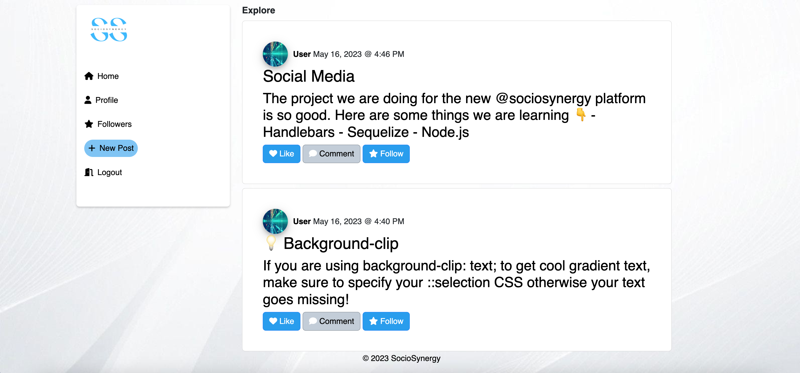
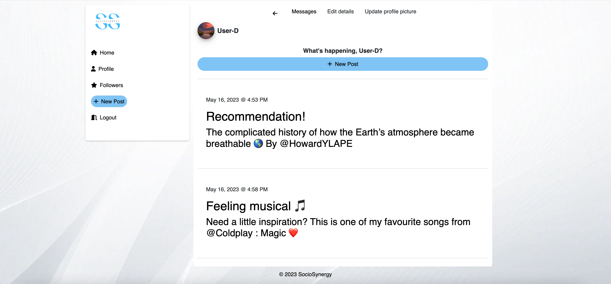

# SocioSinergy

Social media platform that allows users to share their thoughts, opinions, and experiences in real-time. 

## [Table of Contents](#table-of-contents)

- [Description](#description)
- [Final Result](#final-result)
- [Deployment](#deployment)
- [Installation](#installation)
- [Usage](#usage)
- [License](#license)
- [Tests](#tests)
- [Authors](#contact)

## [Description](#table-of-contents)

Designed for individuals to connect and share their thoughts, ideas, and experiences with the world. This social media platform includes features like allowing users to sign up, edit their profile, update a profile picture, create, edit, comment and delete posts, send direct messages to other users,a among other characteristics. 

Our user story is to provide a simple and easy-to-use platform that allows people to express themselves and connect with others on a global scale.
 

`Technologies used:`

- JavaScript
- Handlebars
- HTML
- CSS
- Boostrap
- Node.js
- Express.js
- MySQL
- Sequelize

## [Final Result](#table-of-contents)

## [Deployment](#table-of-contents)

[Link to Heroku](https://sociosynergy1.herokuapp.com/)

## [Installation](#table-of-contents)

To run SocioSinergy, please follow these steps:

1. Install Node.js and MySQL on your machine.
2. Clone the repository to your local system.
3. Open the repository in your preferred code editor.
4. Install the required dependencies by running the following command in the terminal:

> package.json: npm i

5. Set the following environment variables with your MySQL database details:

> DB_NAME='sociosynergy_db'  
> DB_USER='your_username'  
> DB_PW='your_password'

6. Open MySQL shell and insert the commands: 

> source db/schema.sql
> use techblog

7. Exit MySQL shell and start the app by running the following command in your terminal: 

> npm run seed
> node server.js

## [Usage](#table-of-contents)

To use SocioSinergy, follow these steps:

1. Make sure the application is running by executing npm run seed followed by node server.js.
2. Access the application through your preferred web browser.
3. Sign up for a new account or log in if you already have one.
4. Start sharing your thoughts, opinions, and experiences with other users on the platform.
5. Engage with posts from other users by liking and commenting on them.

## [License](#table-of-contents)

Licenced under:

[MIT](https://choosealicense.com/licenses/MIT)

## [Tests](#table-of-contents)

To test this application, follow these steps:

1. Clone the repository to your local system.
2. Open the repository in your preferred code editor.
3. Complete the installation process as described in the Installation section.
4. Start the server and sync the Sequelize models with the MySQL database by running the command node server.js.
5. Use an API development environment (e.g., Insomnia) to test the API routes using various HTTP request methods such as GET, POST, PUT, and DELETE.

## [Authors](#table-of-contents)

This project was created by:

<a href="https://github.com/Abstynent">
  
  Lukasz Jurkiewicz
</a>

<a href="https://github.com/cdrcar">
  
  Carmela Rey
</a>

<a href="https://github.com/Ze7Hu">
  
  Hodan Ibrahim
</a>

